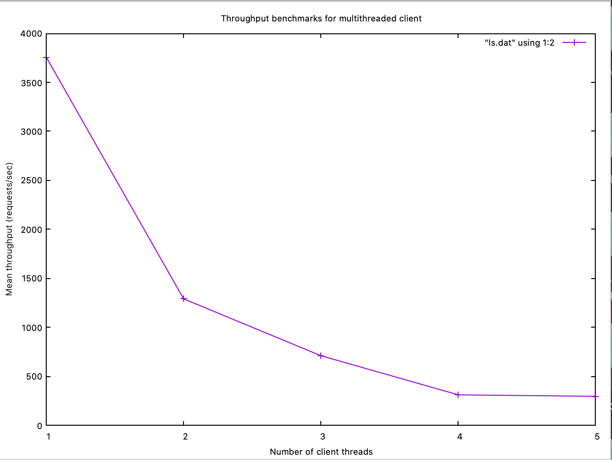
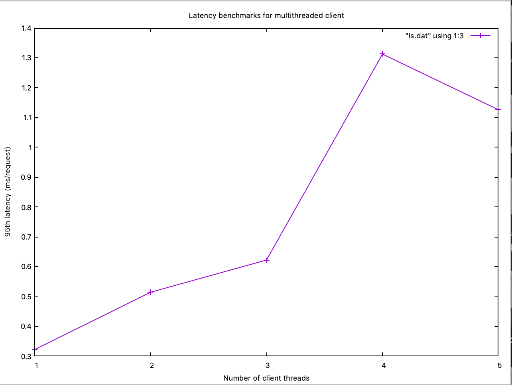
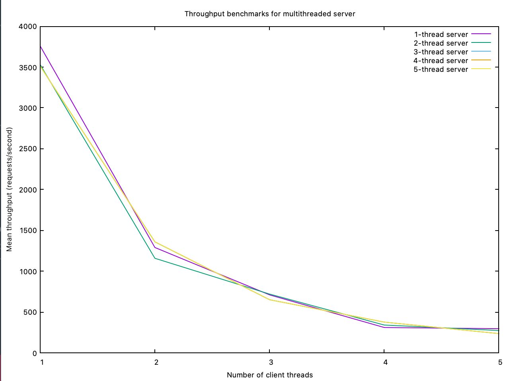
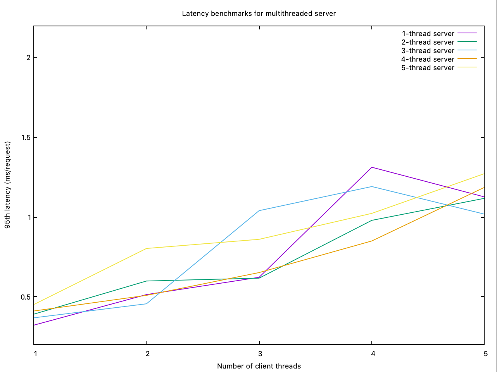

# HW5: Crank it up!

#### Author: Hien Nguyen

### How to run

To build the program,

```
./make
```

Then start the server,

```
./cache_server -m [maxmem]
```

By default, the client will send 1000 requests to the server. To adjust the number of requests, add the new number after the program executable:

```
./workload_generator [nreq]
```

### Part 1: Multithreaded Benchmark

The unsaturated maximum throughput is ~3750 requests/second, when the client is running on a single thread (Figure 1.1). The unsaturated latency is also when the client runs on one thread, at ~0.3 ms/request. These findings suggest that the server is already at capacity with 1000 client requests.


*Figure 1.1: Throughput benchmarks for multithreaded client*


*Figure 1.2: Latency benchmarks for multithreaded client*

### Part 2: Multithreaded Server

In my experiments, I found that multithreaded servers did not improve the cache's performance. The best performance is observed at baseline (measured in part 1). Figure 2.1 and 2.2 show the mean throughput and 95th latency of multiple servers with varying number of parallel threads. Overall, the servers gave comparable performances. This confirms my previous assumption that my cache server reaches capacity with 1000 requests.

It should be noted that my experiments were run on the same machine so server threads might be competing with client threads, which might explain the random peaks in the benchmarks.


*Figure 2.1: Throughput benchmarks for multithreaded server*


*Figure 2.2: Latency benchmarks for multithreaded server*
